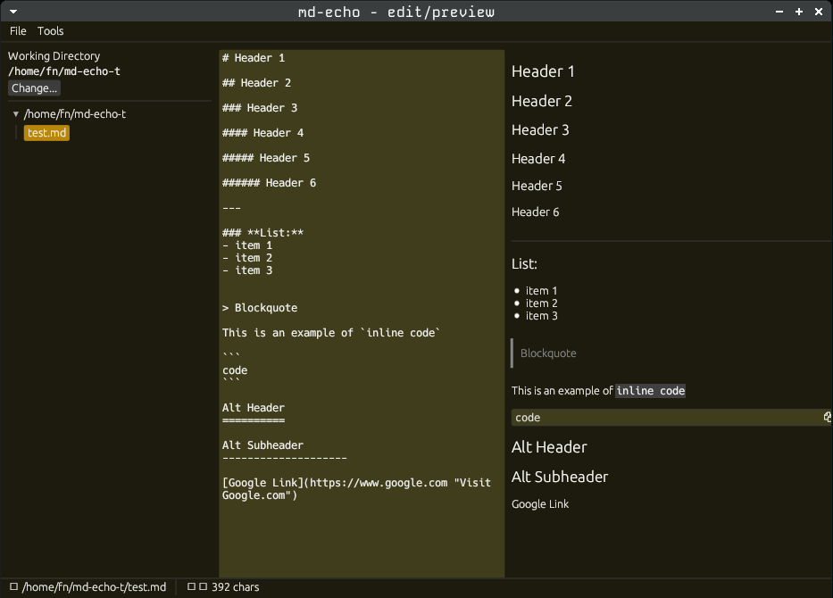

# md-echo
**Minimalist dual-pane Markdown editor & previewer built with egui and eframe**

[](https://crates.io/crates/md-echo)
[](./LICENSE)
[](https://www.rust-lang.org)

---

`md-echo` is a fast, native Markdown editor written in Rust using [`eframe`](https://docs.rs/eframe) and [`egui`](https://docs.rs/egui).
It displays **side-by-side editing and live preview** of Markdown with CommonMark compliance — perfect for quick note editing, technical docs, or journaling.



---

## Features

- Dual-Pane Interface: Edit on the left, preview on the right.
- Live Markdown Rendering: Powered by [`egui_commonmark`](https://crates.io/crates/egui_commonmark).
- File Management: New, Open, Save, Save As, and Exit.
- Unsaved Changes Protection: Confirms before discarding or exiting unsaved work.
- Hotkeys:
  - Ctrl+N — New file
  - Ctrl+O — Open file
  - Ctrl+S — Save
  - Ctrl+Shift+S — Save As
  - Ctrl+Q — Quit
- Configurable Theme & Workspace: Customize colors, accent, and default working directory via `config.toml`.
- Markdown Tooling: Run linter (Ctrl+Shift+L) and formatter (Ctrl+Shift+F) commands with in-app output.
- Status Bar: Shows file name, save state, and character count.

---

## Installation

You’ll need the latest stable Rust toolchain and GTK development headers:

**Fedora / RHEL:**
```bash
sudo dnf install gtk3-devel
```

**Debian / Ubuntu:**
```bash
sudo apt install libgtk-3-dev
```

Then install the crate:
```bash
cargo install md-echo
```

Update existing install:
```bash
cargo install md-echo --force
```

Or build locally:
```bash
git clone https://github.com/fibnas/md-echo
cd md-echo
cargo run --release
```

---

## Usage

Run the app:
```bash
md-echo
```

Then:
- Type Markdown in the left pane.
- Watch the formatted output update instantly in the right pane.
- Use the File menu or shortcuts to open/save documents.
- Use the Tools menu or `Ctrl+Shift+L / Ctrl+Shift+F` to lint or format with your configured commands.

---

### Opening a File from the Command Line

`md-echo` can open a file directly when you pass it as an argument:

```bash
md-echo notes.md
```

or with a full path:

```bash
md-echo ~/projects/todo.md
```

If the file exists, it loads into the editor immediately.
If it doesn’t, a new blank editor opens with that path ready for saving.

---

## Configuration & Customization

`md-echo` looks for an optional config file at `~/.config/md-echo/config.toml`. Copy `docs/config.example.toml` to that location as a starting point:

```bash
mkdir -p ~/.config/md-echo
cp docs/config.example.toml ~/.config/md-echo/config.toml
```

- **Working Directory**: Set `working_dir` to choose the initial folder for the file tree.
- **Colors & Theme**: Adjust the `[theme]` table to switch between `dark`/`light` presets and override hex colors:

  ```toml
  [theme]
  base = "dark"
  background = "#1E1E2E"
  text = "#CDD6F4"
  accent = "#89B4FA"
  ```

- **Markdown Lint & Format**: Configure `[tools]` entries with the command arrays to run. Defaults use [`rumdl`](https://github.com/fibnas/rumdl) if available:

  ```toml
  [tools]
  lint = ["rumdl", "check"]
  lint_use_open_file = false
  format = ["rumdl", "fmt"]
  format_use_open_file = false
  ```

  Trigger these commands from the Tools menu or with `Ctrl+Shift+L` / `Ctrl+Shift+F`. Results (and formatter output) appear in the Tool Output window.

- **Use the current file**: Set `lint_use_open_file` or `format_use_open_file` to `true` to execute the command against the file open in md-echo instead of a temporary buffer. The file must be saved (no pending edits) before running these modes.

---

## Tech Stack

- [`eframe`](https://docs.rs/eframe) — Native app framework for egui
- [`egui_commonmark`](https://crates.io/crates/egui_commonmark) — CommonMark renderer
- [`egui_extras`](https://docs.rs/egui_extras) — Layout helpers
- [`rfd`](https://crates.io/crates/rfd) — Native file dialogs
- Standard library I/O for fast read/write

---

## License

Licensed under the [MIT License](./LICENSE).

---

## Contributing

Pull requests are welcome.
Feel free to fork, tinker, and open an issue or PR if you have improvements.

---

> "Write, preview, and echo your thoughts — all in one window."
